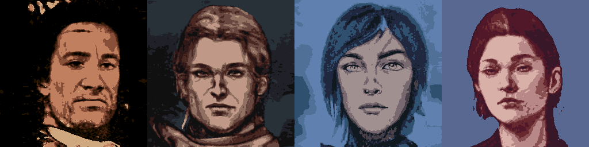

# Game AI - Avatars Generator

A repository for generating character portraits using StyleGan3.

# 1. Creating avatars


## 1.1. Prerequisities
- Download and install cuda - [download link](https://developer.nvidia.com/cuda-11.1.0-download-archive)
- Download and install anaconda - [download link](https://www.anaconda.com/products/distribution/start-coding-immediately)
- Add anaconda to Path - [StackOverflow link](https://stackoverflow.com/questions/44597662/conda-command-is-not-recognized-on-windows-10)
- Install MSVC - [donwload link](https://visualstudio.microsoft.com/vs/), [YouTube tutorial](https://www.youtube.com/watch?v=UA99zPAIDmw)
- Download the model - [gdrive link](https://drive.google.com/file/d/1pMiujcIcl3jdpKrgNzXwburTQ0a5B1Xw/view?usp=sharing)

## 1.2. Setup

Open a command prompt/bash shell in the current directory and run the following commands
```
# clone submodules recursively
git submodule update --init --recursive

# create anaconda environment
conda env create -f environment.yml

# activate environment
conda activate ai-avatars
```

## 1.3. Creating avatars

Run the following comand in the activated environment to generate images
```
# generate a avatar
python stylegan3/gen_images.py --network ./models/fantasy.pkl --outdir ./avatars  --seeds=42 --trunc=0.5
```

# 2. Creating pixelated avatars



## 2.1. Setup 

Follow the steps in 1.1 Setup, that includes dependencies for this part.

## 2.2. Transforming avatars

Run the following comand in the activated environment to generate images

```
# pixelate image
python pixelate.py
```

# 3. FAQ

Q1. I get his error when installing the packages

```
CondaSSLError: OpenSSL appears to be unavailable on this machine. OpenSSL is required to download and install packages.
```

A1. Follow [this tutorial](https://www.youtube.com/watch?v=hfKAV6OYaKw) and copy the dll files to the conda folder.

# 4. References

* Source of ML model (fantasy.pkl) - [GitHub Link](https://github.com/aberghammer/create_avatars_colab/blob/main/create_avatars_colab.ipynb)

# 5. Citations
```
@inproceedings{Karras2021,
  author = {Tero Karras and Miika Aittala and Samuli Laine and Erik H\"ark\"onen and Janne Hellsten and Jaakko Lehtinen and Timo Aila},
  title = {Alias-Free Generative Adversarial Networks},
  booktitle = {Proc. NeurIPS},
  year = {2021}
}
```